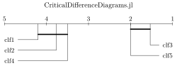

# Critical difference diagrams in Julia

CD diagrams are a powerful tool to compare performances of multiple methods over multiple data sets, as it is oftentimes necessary in machine learning research.




The above example reads as follows: TODO


## Getting started

```
] add https://github.com/mirkobunse/CriticalDifferenceDiagrams.jl
```

TODO


## Assumptions

The hypothesis tests underneath the CD diagram do not account for variances of the method-data scores. It is therefore important that these scores are "reliable" in the sense that the scores are obtained from sufficiently large data samples and that all methods have been evaluated with identical samples. Ideally, the scores come from a cross validation or from a repeated stratified split.


## Citing

CD diagrams have originally been proposed in the following article:

```
@article{demsar2006statistical,
  title={Statistical comparisons of classifiers over multiple data sets},
  author={Dem{\v{s}}ar, Janez},
  journal={Journal of Machine learning research},
  volume={7},
  number={Jan},
  pages={1--30},
  year={2006}
}
```

However, the above article favors Nemenyi's test for the post-hoc analysis.
It has later been argued that Wilcoxon's signed rank test (or the sign test)
are more appropriate for the post-hoc assessment of pairwise differences:

```
@article{benavoli2016should,
  title={Should we really use post-hoc tests based on mean-ranks?},
  author={Benavoli, Alessio and Corani, Giorgio and Mangili, Francesca},
  journal={The Journal of Machine Learning Research},
  volume={17},
  number={1},
  pages={152--161},
  year={2016},
  publisher={JMLR. org}
}
```
