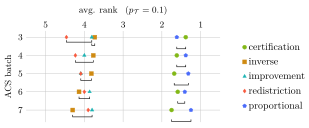

# [Critical difference diagrams in Julia](https://mirkobunse.github.io/CriticalDifferenceDiagrams.jl/stable)

This package generates Tikz code for publication-ready vector graphics.

Critical difference (CD) diagrams are a powerful tool to compare outcomes of multiple treatments over multiple observations. For instance, in machine learning research we often compare the performance (= outcome) of multiple methods (= treatments) over multiple data sets (= observations). A wrapper for Python is also available.

**Regular CD diagrams:** indistinguishable methods are connected.

**2D sequences:** sequences of multiple CD diagrams can be arranged in a single 2-dimensional axis.

For more information, please refer to [the documentation](https://mirkobunse.github.io/CriticalDifferenceDiagrams.jl/stable).
