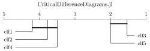

# [CriticalDifferenceDiagrams.jl](@id Home)

Critical difference (CD) diagrams are a powerful tool to compare outcomes of multiple treatments over multiple observations. For instance, in machine learning research we often compare the performance (outcome) of multiple methods (treatments) over multiple data sets (observations). This Julia package generates Tikz code to produce publication-ready vector graphics. A wrapper for Python is also available.


## Reading a CD diagram

Let's take a look at the treatments `clf1` to `clf5`. Their position represents their mean ranks across all outcomes of the observations, where low ranks indicate that a treatment wins more often than its competitors with higher ranks. Two or more treatments are connected with each other if we can not tell their outcomes apart, in the sense of statistical significance. For the above example, we can not tell from the data whether `clf3` and `clf5` are actually different from each other. We can tell, however, that both of them are different from all of the other treatments. This example above is adapted from https://github.com/hfawaz/cd-diagram.

```@raw html

```

A diagram like the one above concisely represents multiple hypothesis tests that are conducted over the observed outcomes. Before anything is plotted at all, the Friedman test tells us whether there are significant differences at all. If this test fails, we have not sufficient data to tell any of the treatments apart and we must abort. If, however, the test sucessfully rejects this possibility we can proceed with the post-hoc analysis. In this second step, a Wilcoxon signed-rank test tells us whether each pair of treatments exhibits a significant difference. Since we are testing multiple hypotheses, we must adjust the Wilcoxon test with Holm's method. For each group of treatments which we can not distinguish from the Holm-adjusted Wilcoxon test, we add a thick line to the diagram.


## Getting started

CriticalDifferenceDiagrams.jl can be installed through the Julia package manager. From the Julia REPL, type `]` to enter the Pkg mode of the REPL. Then run

```
pkg> add CriticalDifferenceDiagrams
```

The example plot above is then generated with the following code:

```julia
using CriticalDifferenceDiagrams, CSV, DataFrames, PGFPlots

# we generate the above example from the underlying data
url = "https://raw.githubusercontent.com/hfawaz/cd-diagram/master/example.csv"
df = CSV.read(download(url), DataFrame)

plot = CriticalDifferenceDiagrams.plot(
    df,
    :classifier_name, # the name of the treatment column
    :dataset_name,    # the name of the observation column
    :accuracy;         # the name of the outcome column
    maximize_outcome=true, # compute ranks for minimization (default) or maximization
    title="CriticalDifferenceDiagrams.jl" # give an optional title
)

# configure the preamble of PGFPlots.jl (optional)
pushPGFPlotsPreamble("""
    \\usepackage{lmodern}
""")

# export to .svg, .tex, or .pdf
PGFPlots.save("example.svg", plot)
```


## Cautions

The hypothesis tests underneath the CD diagram do not account for variances of the outcomes. It is therefore important that these outcomes are "reliable" in the sense that each of them is obtained from a sufficiently large sample. Ideally, they come from a cross validation or from a repeated stratified split. Moreover, all treatments must have been evaluated on the same set of observations.


## Citing

CD diagrams have originally been proposed in the following article:

```
@article{demsar2006statistical,
  title={Statistical comparisons of classifiers over multiple data sets},
  author={Dem{\v{s}}ar, Janez},
  journal={The Journal of Machine learning research},
  volume={7},
  number={1},
  pages={1--30},
  year={2006}
}
```

However, the above article favors Nemenyi's test for the post-hoc analysis.
It has later been argued that Wilcoxon's signed rank test (or the sign test)
are more appropriate for the post-hoc assessment of the pairwise differences:

```
@article{benavoli2016should,
  title={Should we really use post-hoc tests based on mean-ranks?},
  author={Benavoli, Alessio and Corani, Giorgio and Mangili, Francesca},
  journal={The Journal of Machine Learning Research},
  volume={17},
  number={1},
  pages={152--161},
  year={2016}
}
```
